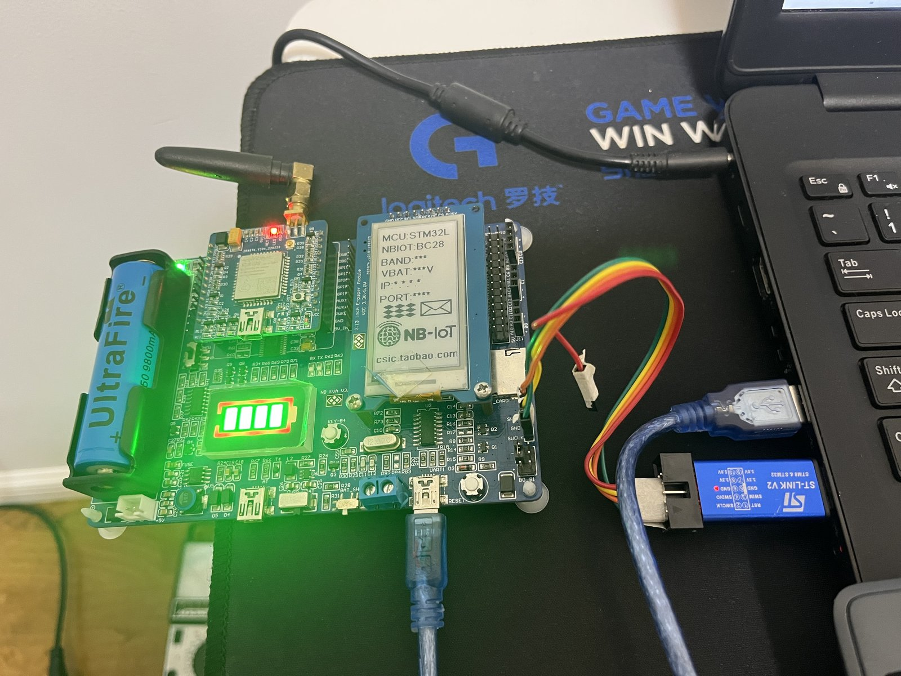
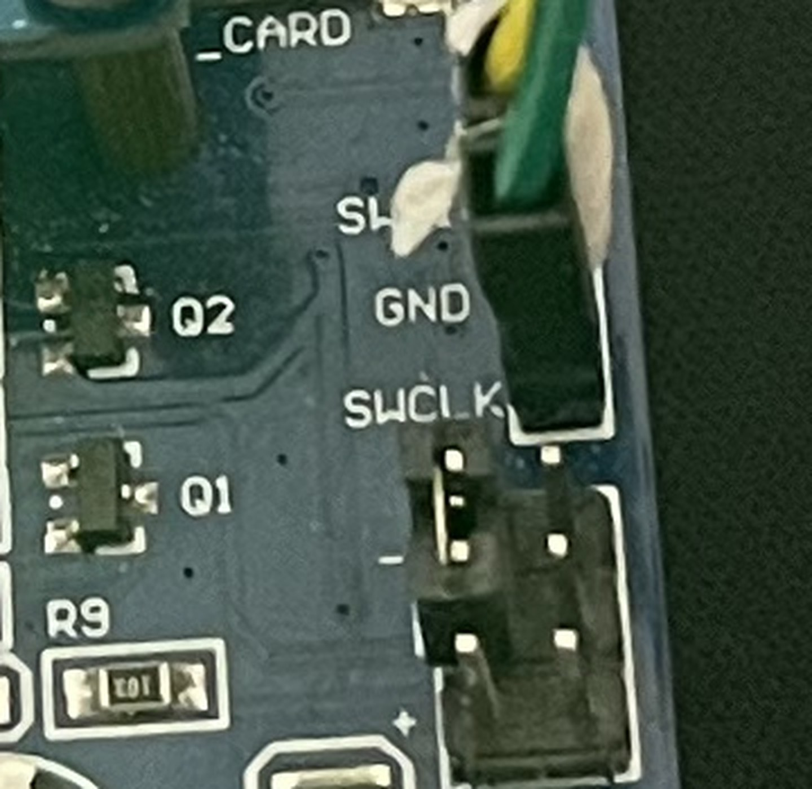
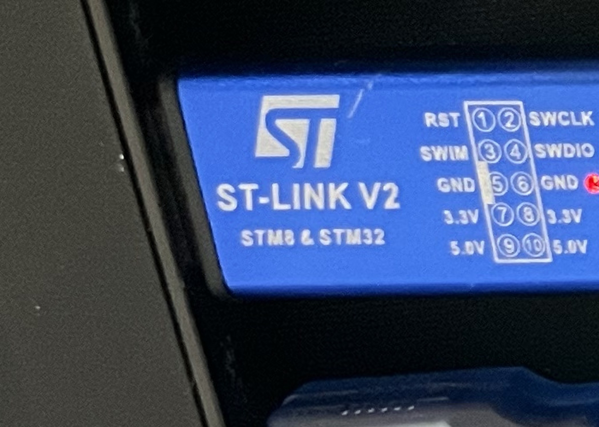

# STM32L151 + BC28 开发板 · 操作手册（第 1 篇：搭好初始环境）

> ### 这是一个系列的**第 1 篇**
>
> 本篇只干一件事：把这套板子的 **「编译 → ST-Link 下载 → 串口打印」从零跑通**。
> **跑通本篇 = 你手上有了一个"能改代码、能烧进去、能看日志"的工作环境** —— 后面所有
> 联网、外设、联网+外设的实验，都建在这个环境上。
>
> 所以本篇是**地基**，不含任何 NB-IoT / 墨水屏的具体功能。系列往后打算这么走：
>
> | 篇 | 主题 | 状态 |
> |---|---|---|
> | **第 1 篇** | **搭建初始环境**（编译 / 下载 / 看日志） | ✅ **本篇** |
> | 第 2 篇 | BC28 插卡 + 验信号覆盖（QNavigator） | ⬜ 待写 |
> | 第 3 篇 | BC28 注册上网 → 把数据发到自己的服务器 | ⬜ 待写 |
> | 第 4 篇 | 墨水屏（这块板子出厂配的那个屏） | ⬜ 待写 |
>
> **读法约定**：下文出现这几个**占位符**，一律换成你自己的。括号里是作者那台机器的实际值，
> 只是给你个样子 —— **不要照抄**，路径对不上会以为是步骤错了：
>
> | 占位符 | 意思 | 作者的实际值 |
> |---|---|---|
> | `<工程目录>` | Hello World 那个工程放在哪 | `D:\claudecode\stm32-bc28\print-helloworld` |
> | `<工具目录>` | 本套脚本（`flash_and_run.bat` 等）放在哪 | `D:\windows11-tools\stm32-bc28` |
> | `<资料包>` | 厂家资料包根目录 | `D:\stm32\stm32\STM32L151-BC28PROV3.5` |
> | `<Keil 安装目录>` | Keil MDK 装在哪 | `C:\Keil_v5` |
> | `<COM 口>` | 板子 USB1 在设备管理器里的端口号 | `COM6` |
>
> 凡是我**没验证过**的东西都在 §8.3 单独标出来了，不会拿"应该可以"糊弄你。

**这块板子怎么「编译 → ST-Link 下载 → 串口打印」一条龙跑通。**

- 板子：STM32L151RC（Cortex-M3）+ BC28（NB-IoT）+ CH340G 串口 + 墨水屏接口 + 锂电管理
- 本篇覆盖的路线：**Keil 命令行编译 → ST-Link 下载 → 板载 USB1（CH340）看日志**
- 首次验证：**2026-09-12**，Windows 11 + Keil MDK 5.24a + ST-Link V2 克隆版
- 本篇只讲**已验证**的这条 ST-Link 路线。串口下载（mcuisp）那条**没走通**，不在本篇范围内

---

## 0. 三步速查（熟了只看这一节）

```
① 接两根线：ST-Link → 3 针 SWD 口；板子 USB1 → 电脑
   黑色拨键拨到左边（USB 档）并拨到底，POW 灯亮
② 双击 flash_and_run.bat（放在工程目录下，或工具目录里）
③ 看到 RX> Hello World  #N 就是成功
```

---

## 1. 硬件准备

### 1.1 接线（**两根线，缺一不可**）



| 干什么 | 接哪里 | 注意 |
|---|---|---|
| **烧录/调试** | ST-Link 的 **SWDIO / SWCLK / GND** → 板上 **3 针 SWD 口**（**具体哪个脚接哪个针 → §1.1.1**） | ST-Link 就 **3 根线**，**没有 VCC，它不给板子供电** |
| **供电 + 看日志** | 板子**自己的 USB1**（CH340）→ 电脑 USB 口 | 跟 ST-Link 是**两根独立的线** |

> **ST-Link 只管信号，不供电**（3 根线：SWDIO / SWCLK / GND）。
> 板子的电**只能来自 USB1，或者锂电池** —— 由下面那个拨码开关选。别的来源没有。
>
> 所以在调试这条路上，**USB1 是一根线干两件事：供电 + 串口**。
> 它没插 = 板子全黑 + 电脑上看不到 COM 口（见 6.1）。**这就是为什么它会同时造成两个症状。**

> **最常见的坑**：ST-Link 插了、烧录也成功了，串口却一个字都没有 —— **因为 USB1 没插**。
> 「ST-Link 插着」≠「串口插着」。

**两个 USB 口的分工**（原理图已确认）：

| 口 | 是什么 | 干什么 |
|---|---|---|
| **USB1** | CH340G（**主 USB**） | **给 STM32 供电 + 输出调试/串口信息** —— 本篇看日志就用它 |
| **USB2** | FT232 / PL 那条（另一个 USB 口） | 另一个数传/调试口；**它的 VBUS 也接在同一条 `VCC_USB` 上**，所以插它也能给板子供电 |

**角色分工一句话**：**ST-Link 只负责下载（load）和调试**（不供电、不输出日志）；
**USB1 负责供电 + 出调试信息**。

#### 1.1.1 SWD 那三根线具体接哪个脚

板上是 **3 针**排针，丝印从上到下是 **`SWDIO` / `GND` / `SWCLK`**：



| 板上丝印 | 芯片脚 | 接到 ST-Link V2 的哪个针 |
|---|---|---|
| **SWDIO** | PA13 | **4** |
| **GND** | GND | **5 或 6**（两个都是 GND，随便哪个） |
| **SWCLK** | PA14 | **2** |

而 ST-Link V2（克隆版）排针上的丝印是这么排的 —— **它不按 1-2-3 的顺序排，别想当然**：



```
RST   [1][2]  SWCLK     ← 用 2
SWIM  [3][4]  SWDIO     ← 用 4
GND   [5][6]  GND       ← 用 5 或 6
3.3V  [7][8]  3.3V      ← 不接
5.0V  [9][10] 5.0V      ← 不接
```

> ⚠️ **`3.3V` / `5.0V` 这四个针一个都别接。** 这块板子的 SWD 口**不提供 3.3V**，板子自己由 USB1
> 或电池供电。很多 ST-Link 教程会让你接 VTref/3.3V —— **这里不接**，两边各供各的电。
> （接 5.0V 等于往板子上反灌电，没必要，也可能出事。）

> ✅ **插反了不会烧东西。** 3 针排针没有防呆，反插只会让 **SWDIO 和 SWCLK 对调**、GND 仍在中间，
> 表现就是 Keil 连不上/识别不到内核。**对调回来即可，不会损坏板子或 ST-Link。**

**怎么知道接对了 —— 不用烧录，在 Keil 里三十秒就能看出来：**

1. 用 Keil 打开工程，点工具栏那个**魔术棒**（Options for Target）
2. 切到 **Debug** 页 → 右上角 **Use** 下拉选 **ST-Link Debugger**
3. 点它右边的 **Settings** → 弹窗里**能看到插着的 ST-Link 设备**（列表/下拉里会列出设备）
4. 没插设备，那一栏就是**空的**（提示**无连接设备**）

> **不想开 Keil 也能查这一步**：插上 ST-Link，设备管理器 → **通用串行总线设备** 下面能看到
> **`STM32 STLINK`**，就说明电脑已经认到它了（拔掉就消失）。

**能看到设备 = ST-Link 认到了。** 再看弹窗里 **SW Device** 那一栏有没有内核 ID
（本板实测 **`SW-DP IDCODE = 2BA01477`**）—— **读到 ID = 三根信号线也接对了**；
读不到 ID 先怀疑 SWDIO / SWCLK 是不是反了（见上面那条）。

> ⚠️ **看完把弹窗和 Keil 都关掉**（点 **Cancel** 退出即可）。这个界面**本身就占着 ST-Link**，
> 留着它再去跑 §3 的命令行烧录，就会撞上 §6.4 的 `Target DLL has been cancelled`。

### 1.2 供电：那个**黑色拨键**（电源选择）

板上那个**黑色拨动键**（原理图里是 **SW7**，标注「电源选择拨码开关 / 卧式拨动开关_创思」）
就是电源选择开关，**必须拨到底**：

| 拨向 | 档 | 电从哪来 | 能不能看日志 |
|---|---|---|---|
| **← 左** | **USB 档** | 由 USB 口供电（**USB1 为主口**；USB2 的 VBUS 也在这条 `VCC_USB` 上） | ✅ 能（USB1 插着就有） |
| **→ 右** | **电池档** | 板载锂电池 / `+BAT` 上的 18650 | ❌ **看不到**（USB1 没插就没有 COM 口） |

原理图上这块的标注原文就是：**「由拨码开关选择是USB供电还是电池供电」**；SW7 两边的网标
一边是 `+5`/`VCC_5V`、一边是 `BAT_VCC`/`BAT` —— 跟「**左 USB、右 电池**」一致。

调试期**固定拨到左边（USB 档）**（USB 档**不影响充电**，充电照常进行）。

判据看板上那颗常亮的 **POW 灯**（跨在 3.3V 上）：**POW 灯灭 = 3.3V 没起来 = MCU 没电**。

> ⚠️ **别跟另一个键搞混：**
> - **黑色拨键**（SW7）= 电源选择：**左拨 = USB 供电**，**右拨 = 电池供电**（必须拨到底）
> - **`BAT_SHOW` 那个拨动键** = **显示电池电量**用的（点亮电池电量指示灯），**跟 MCU 供电无关**

> ⚠️ **充电灯亮 ≠ 3.3V 有。** 充电走 `VCC_USB → FUSE → VUSB → TP5410`，**不经过这个开关**。
> 所以会出现「红灯在充电、板子却全死」的迷惑现象，别误判成板子坏。

### 1.3 串口参数

| 项 | 值 |
|---|---|
| 端口 | CH340 那个 COM 口 = `<COM 口>`（作者机器上是 `COM6`）。**去设备管理器 → 端口(COM 和 LPT) 里看你自己那个** |
| 波特率 | **9600** |
| 数据位 / 校验 / 停止位 | 8 / 无 / 1 |
| **流控** | **必须选「无」** —— 打开 DTR/RTS 会把 STM32 按在复位上，表现成「串口能打开但一个字都没有」 |

---

## 2. 软件准备（一次性）

### 2.0 你要准备的四样东西（含"从哪来"）

| # | 要什么 | 从哪来 | 缺了会怎样 |
|---|---|---|---|
| ① | **这块板子**：STM32L151 + BC28，V3.5 | 卖家/厂家 | —— |
| ② | **厂家资料包**（作者手上那份约 3.4 G） | **跟板子一起要过来**（网盘/U 盘）。里面有原理图 PDF、13 个例程工程、Keil 4.72、mcuisp、CH340/ST-Link 驱动、QNavigator、墨水屏资料 | §5.2 换例程没法做，**第 2–4 篇全要它** |
| ③ | **本套脚本** = `<工具目录>` | **本仓库的 `02-工具\`**（跟本篇一起下载）。没有它，§3 的"双击"跑不起来，得自己敲 Keil 命令行 | 每个操作都退化成手敲命令 |
| ④ | **`Keil.STM32L1xx_DFP.1.2.0.pack`**（约 23 MB） | **不在厂家资料包里**，要单独下（Keil 官方器件包页面 `keil.com/dd2/pack`，或直接跟作者要一份） | 下载报 `Flash download failed - Cortex-M3`（见 §6.3） |

> 板子**别放在中文长路径里** —— 厂家自己的说明里就警告过会缺文件。**路径短、纯 ASCII**。

### 2.1 电脑上要装的软件

| 装什么 | 干什么用 | 注意 |
|---|---|---|
| **Keil MDK-ARM** | 编译 + 下载 | 作者用的是 **5.24a**（装在 `<Keil 安装目录>`）。**必须带 ARM Compiler 5（AC5）** —— 作者机器上是 `V5.06 update 5 (build 528)` |
| **器件包 `Keil.STM32L1xx_DFP` 1.2.0** | 提供烧写算法 `STM32L1xx_256.FLM` | **不装 → 下载报 `Flash download failed - Cortex-M3`**。装完**重启 Keil** 才认。包见 §2.0 ④ |
| **CH340 驱动** | USB1 当串口用 | 装完设备管理器里出现 COM 口（资料包 `7.万能驱动` 里有） |
| **ST-Link 驱动** | SWD 下载 | 装 Keil 时一般会一并装上（资料包 `7.万能驱动` 里也有）。**装好没装好怎么验**：插上 ST-Link，设备管理器 → **通用串行总线设备** 下面能看到 **`STM32 STLINK`** |
| **Python 3** | 只有 `prep_project.py` 用 | 不换例程就不需要 |

> ⚠️ 这批代码是 2018 年的 ST 标准外设库（SPL），**用 AC6（ARMCLANG）编不过**，必须 AC5。
> 新一点的 MDK（5.37+）不自带 AC5，要单独装插件。

### 2.2 工具在哪

本套脚本就是**一个目录**（= `<工具目录>`），里面全部内容：

```
<工具目录>\
├─ flash_and_run.bat   ← 双击这个（编译+下载+看日志）
├─ flash_and_run.ps1   ← bat 实际调用的主脚本
├─ read_com.bat / .ps1 ← 只看日志，什么都不烧
├─ probe_boot.ps1      ← 串口下载诊断（本篇用不上，第 2 篇起也用不着）
├─ prep_project.py     ← 修厂家例程的三处缺陷（§5.2 用）
├─ inspect_proj.py     ← 体检工具：只报告不改，列工程的 IncludePath / -FP0 / -FO 现状
└─ README.md           ← "换一台电脑"怎么办（拷什么、装什么）
```

**这套脚本不用另外找，就在本仓库的 `02-工具\` 里**，跟本篇一起下载。整个目录拷到你自己的机器上即可。

**拿到之后只改一行**：`flash_and_run.bat` 和 `read_com.bat` 里各有一行兜底路径写着作者机器的位置

```bat
if not exist "%PS1%" set "PS1=D:\windows11-tools\stm32-bc28\flash_and_run.ps1"
```

**把它改成你实际放这套脚本的目录**，否则双击会报 `Cannot find flash_and_run.ps1`。改完就只把
**`flash_and_run.bat` 一个文件**拷到工程目录下双击（其余文件留在原地，别一起拷，副本会跟正本走散）。

**除此之外脚本不写死本机路径**：Keil 装在哪儿、烧写算法在哪儿都是自动探测的，所以可以整份搬到别的电脑。
你把它放在**哪都行**（英文路径更好），下文统一用 `<工具目录>` 指它。

---

## 3. 日常操作

### 方式 A：双击（推荐）

把 **`flash_and_run.bat`** 拷到工程目录下双击即可。它会从**自己所在的目录**开始找 `Project.uvproj`：
先往**上**找最近的祖先目录，再按 `\MDK-ARM\Project.uvproj` 后缀逐层往**下**找（浅的优先）。

- **找到一个** → 直接用
- **找到多个** → 列出来让你选，**回车 = 取产物最新的那个**（= 你最近编译过的工程）；加 `-Yes` 则不提问直接取最新

它会依次做：**`-b` 编译 → 编译报错（rc≥2）就中止、绝不烧 → `-f` 下载 → 打开串口打日志**。

> ⚠️ **双击前先关掉 Keil。** Keil 界面开着时它占着 ST-Link，命令行会报 `Target DLL has been cancelled`。

### 方式 B：命令行

```bat
:: 不传工程路径：在"当前目录"里自动找工程
powershell -NoProfile -ExecutionPolicy Bypass -File "<工具目录>\flash_and_run.ps1"

:: 换任何工程：把工程目录（或 .uvproj 文件）传进去，这是唯一要改的地方
powershell ... -File "<工具目录>\flash_and_run.ps1" "<另一个工程目录>"

:: 常用开关
powershell ... -File "<工具目录>\flash_and_run.ps1" -Seconds 10   :: 多看几秒日志
powershell ... -File "<工具目录>\flash_and_run.ps1" -NoBuild      :: 跳过编译，烧上次的产物
powershell ... -File "<工具目录>\flash_and_run.ps1" -SkipFlash    :: 只读日志，什么也不烧
powershell ... -File "<工具目录>\flash_and_run.ps1" -Yes          :: 多工程时不问，直接取最新的
```

### 方式 C：只想看日志

双击 `read_com.bat`（或 `read_com.ps1 -Seconds 20`）。它**只读什么都不烧**，会自动找 COM 口。

**打开串口不会打断程序运行**（实测计数器连续），读日志是安全的。

---

## 4. 成功的样子（照着对）

### 4.1 编译

```
*** Using Compiler 'V5.06 update 5 (build 528)', folder: '<Keil 安装目录>\ARM\ARMCC\Bin'
Build target 'STM32L1XX_MD(STM32L1xxxBxx)'
".\STM32L152-EVAL\STM32L152-EVAL.axf" - 0 Error(s), 0 Warning(s).
  rc=0  (0 = ok, 1 = warnings, >=2 = errors)
```

### 4.2 下载

```
Load "<工程目录>\Project\Test\MDK-ARM\STM32L152-EVAL\STM32L152-EVAL.axf"
Erase Done.Programming Done.Verify OK.Application running ...
  rc=0  (0 = ok)
```

> **判据：`flash.log` 里必须出现 `Application running ...`。**
> 有它就代表下载完芯片**自动复位并开始运行**；没有它 = 芯片被留在**停机**状态（见 6.6）。

### 4.3 串口

```
############ STM32L151 + BC28 ############
############  Hello World    ############
build: Sep 12 2026 18:26:xx

Hello World  #0
Hello World  #1
...
```

**每秒一行**（`Delay(1000)`），同时板上 PC3 那颗灯每秒翻转一次 —— **不看串口也能用它确认程序在跑**。

---

## 5. 换一个程序 / 换一个工程

### 5.1 先说清楚：烧的是哪个文件

**指定不了文件。** Keil 烧的是**工程自己的编译产物** —— `Load` 那行打印的那份：
`<OutputDirectory>\<OutputName>.axf`（本工程 = `Project\Test\MDK-ARM\STM32L152-EVAL\STM32L152-EVAL.axf`）。

所以「换个东西烧」只能靠**换工程**或**换 target**：

| 想干什么 | 怎么办 |
|---|---|
| 烧另一个工程 | 把工程路径传给脚本（或把 bat 拷到那个工程目录下双击） |
| 烧同一工程里另一个 target | `-Target "target 名"`（本板一律 target 1 = `STM32L1XX_MD(STM32L1xxxBxx)`） |
| 改产物名 / 输出目录 | uvproj 里的 `<OutputName>` / `<OutputDirectory>` |
| 烧别人编的裸 `.hex`/`.axf` | **Keil 命令行做不到**，要 STM32CubeProgrammer CLI（作者机器上没装，本篇未验证） |

> ⚠️ **`-f` 只下载、不编译！** 它烧的是「**上次编译出来的**」那份 axf。
> 所以「**改了 `main.c` 不编译就直接烧 = 烧进去的还是旧程序**」，而且**没有任何报错**。
> 判断方法：看 `.axf` 的时间戳是不是你刚编译的。**先编译再下载**（脚本默认就带编译）。

### 5.2 换资料包里的例程（13 个例程通用）

**每个例程工程都得先补三处缺陷**，否则会在三个不同的坑里各摔一次：

| # | 缺陷 | 不修的后果 |
|---|---|---|
| ① | `IncludePath` 缺 `..\..\..\Libraries\CMSIS\Include` | 报 `cannot open source input file "core_cm3.h"`，**编不过** |
| ② | 驱动串缺 `-FP0(<FLM 绝对路径>)` | 报 **`Erase Failed!`**（错误信息极具误导性，跟保护/容量无关），**烧不进去** |
| ③ | 驱动串是 `-FO7` 而不是 `-FO15` | 下载成功但芯片停机，**串口没输出** |

```bat
:: ① 把例程拷到英文短路径（原始路径带中文且超长，厂家自己都警告过会缺文件）
xcopy /E /I "<资料包>\5.程序代码\3.通过TCP协议与阿里云双向透传\STM32L1xx_StdPeriph_Lib_V1.3.1" D:\work\tcp-demo\

:: ② 自动补三处缺陷（幂等，带 .bak-prep 备份；--check 只检查不改）
python "<工具目录>\prep_project.py" D:\work\tcp-demo\Project\Test\MDK-ARM

:: ③ 编译 + 下载 + 看日志
powershell -NoProfile -ExecutionPolicy Bypass -File "<工具目录>\flash_and_run.ps1" "D:\work\tcp-demo\Project\Test\MDK-ARM"
```

> 这里的 `D:\work\tcp-demo\` 是"**你的英文短路径工作目录**"，随便挑个地方就行 —— 作者放在
> `D:\claudecode\stm32-bc28\tcp-demo\`。**关键是短 + 纯 ASCII**，别留在资料包那个中文长路径里。

> ③ **每个例程取值还不一样**（例程 3 是 `-FO7`、例程 12 已经是 `-FO15`），**不能照抄**，必须逐个检查。

**已实测**：例程 3 拷到 `tcp-demo\` 跑完 prep → 编译 `0 Error / 0 Warning` → 下载 `Verify OK / Application running`
→ 串口打出它自己的启动日志 `EINK DISPLAY BMP PICTURE OK` / `init stm32L COM1` / `start init bc28`。

---

## 6. 故障排查

### 6.1 COM 口一个都没有（`NO COM PORT PRESENT`）

**原理图已确认**：CH340G 的 VCC（16 脚）直接接 `VCC_USB` = **USB1 座子的 VBUS，在电源选择开关之前**。
所以它**只看线，跟开关位置无关**：

| 现象 | 结论 | 怎么办 |
|---|---|---|
| **一个 COM 口都没有**（板子通常也全黑） | USB1 没插到**这台电脑** | 插到电脑 USB 口。**插充电器 / 充电宝 / 关掉的 HUB 都不算**（那不是 USB 主机）——那种情况板子有电但没 COM 口 |
| 同上，换线也不行 | 线是**只能充电**的线（VBUS 通、D+/D- 不通）／线坏／电脑口坏 | 换一根**能传数据**的线、换一个 USB 口 |
| **端口有但零字节**，POW 灯灭 | 电源开关没拨到位，3.3V 没起来 | 把**黑色拨键拨到左边（USB 档）并拨到底** |
| **端口有但零字节**，POW 灯亮 | 程序没跑，或串口工具**流控不是「无」** | 检查流控；重新下载一次 |

> **拨码开关位置不可能造成「端口消失」** —— 它影响的是 MCU，不是 CH340。别据此判板子坏。
> `read_com` 遇到这种情况会把上表打出来并**等你 20 秒**（插件后自动接着抓，不用重新运行）。

### 6.2 `Erase Failed!` 但芯片明明是好的

→ **驱动串缺 `-FP0(<FLM 绝对路径>)`**。ST-Link 下载的**权威参数在 `Project.uvopt` 里**，
不在 `uvproj` 里：`<TargetDriverDllRegistry>` → `Key=ST-LINKIII-KEIL_SWO` 那条 `<Name>` 串。

驱动手上没算法可跑，**却报成 `Erase Failed!`**（看着像读出保护/容量/擦除方式问题，**全不是**）。
跑 `prep_project.py` 补上即可。改 `uvproj` 里的 `<FlashDriverDll>` **不解决问题**。

### 6.3 `Flash download failed - Cortex-M3`

→ **没装 `Keil.STM32L1xx_DFP` 器件包** → 全盘没有任何 STM32L1 的 `.FLM` 烧写算法。
装包（`Keil.STM32L1xx_DFP.1.2.0.pack`，见 §2.0 ④），**装完重启 Keil**。

### 6.4 `Target DLL has been cancelled`

→ **Keil 界面开着**，它占着 ST-Link。关掉 Keil 再用命令行。**ST-Link 只能被一个程序占用。**

### 6.5 Keil 里看不到 ST-Link 设备（`Settings` 里那栏是空的 / 无连接设备）

进去看的地方就是 §1.1.1 那条路：**魔术棒 → Debug → Use 选 `ST-Link Debugger` → Settings**。
那一栏**空着**（或写着**无连接设备**）= **Keil 根本没认到这个 ST-Link**，跟板子、跟接线都无关。查三样：

| 查什么 | 怎么查 |
|---|---|
| **驱动** | 插着 ST-Link，看**设备管理器 → 通用串行总线设备** 下面有没有 **`STM32 STLINK`** 这一项（本机实测的显示名就是这个）。没有就装驱动：资料包 `7.万能驱动` 里有，Keil 安装时一般也会带上 |
| **线** | USB 线插的是**电脑**、不是充电头；换一根线、换一个 USB 口。ST-Link 那根是数据线，接头不对就换 |
| **被别的程序占着** | 开了两个 Keil、或 ST-Link Utility / CubeProgrammer 开着，都会读不到。**全关掉再试** |

> **设备能列出来、只是 SW Device 里没有 IDCODE** —— 那是**另一回事**：ST-Link 认到了，
> 但**认不到芯片**。这时回去看 §1.1.1 那三根线（SWDIO / SWCLK 是不是反了）
> 和板子有没有电（POW 灯亮不亮，见 §1.2）。

### 6.6 下载成功、`Verify OK`，但串口一个字都没有

→ 驱动串是 `-FO7` 而不是 **`-FO15`**（= Keil 的 **Reset and Run**）。
芯片下载完被留在**停机**状态，主循环没跑起来。

**判据**：`flash.log` 里有没有 **`Application running ...`**。
跑 `prep_project.py` 改掉。**注意 `-TO18`（HW RESET）不用改** —— SWD 口没有 NRST 线也照样能自动运行。

### 6.7 编译报 `cannot open source input file "core_cm3.h"`

→ `IncludePath` 缺 `..\..\..\Libraries\CMSIS\Include`。跑 `prep_project.py`。
（这正是厂家截图里那个问题，资料包只给了截图没给解法。）

### 6.8 「用 Keil 的 Load 下载了，但行为没变」

→ **没重新编译**。`-f` / Load 只下载不编译，烧的还是上次那份 axf。
先编译（`-b`），或用脚本（默认带编译）。判据：`.axf` 时间戳。

### 6.9 以后 ②③ 两个坑又回来了

→ **`.uvopt` 被 Keil 界面覆写了**。谁在 Options for Target → Utilities → Settings → Flash Download
里动过算法列表，那条 `<Name>` 串就可能被重写。

**建议顺手在界面上确认一次**（勾了之后 Keil 自动保存就一直是 `-FO15`，不会再退回去）：
- Options for Target → Utilities → Settings → Flash Download → 勾上 **Reset and Run**
- Options for Target → Debug → Settings → Reset 选 **SYSRESETREQ**

对照备份检查：`Project.uvopt.bak-prep` / `.bak-hello` / `.bak-fo`。

---

## 7. 一页 Checklist

```
□ 黑色拨键（电源选择）拨到左边 = USB 档，并拨到底，POW 灯亮
□ ST-Link 的 SWDIO/SWCLK/GND → 板上 3 针 SWD 口（就 3 根线，ST-Link 不给板子供电）
□ Keil 里认得到：魔术棒 → Debug → Use 选 ST-Link Debugger → Settings 能看到设备（§1.1.1）
□ 板子 USB1（CH340）→ 电脑 USB 口（既供电又是串口）      ← 最容易漏
□ Keil 界面已关闭（否则 ST-Link 被占用）
□ 串口工具：<COM 口> / 9600 / 8-N-1 / 流控「无」
□ 工程的三处缺陷已修（prep_project.py；换例程必做，本工程已修好）
□ 双击 flash_and_run.bat（或 read_com.bat 只看日志）
□ 编译 0 Error 0 Warning
□ 下载 Erase Done / Programming Done / Verify OK / Application running
□ 串口每秒一行 Hello World  #N，PC3 灯每秒翻转
```

---

## 8. 附录

### 8.1 各种文件是干什么的

| 文件 | 角色 |
|---|---|
| `Project.uvproj` | 工程文件：源文件列表、IncludePath、`<OutputName>`/`<OutputDirectory>` |
| `Project.uvopt` | **下载参数的权威来源**（那条 `ST-LINKIII-KEIL_SWO` 驱动串就在这） |
| `STM32L152-EVAL.axf` | **Keil 下载用的就是它**（含调试信息）。名字里的 L152 是厂家没改的官方例程输出名，芯片其实是 L151RC |
| `STM32L152-EVAL.hex` | 给**别的**烧写工具用的（STM32CubeProgrammer 等），Keil 自己不用 |
| `STM32L151-BC28-hello.hex` | 根目录那份只是**好认的副本**，**只有加 `-HexCopyTo` 才会刷新** |
| `STM32L1xx_256.FLM` | 芯片的**烧写算法**（256 = 256 KB Flash），由器件包提供 |

> 每次编译 hex 的 md5 都会变，因为 banner 里嵌了 `__DATE__ __TIME__`，**不是编坏了**。

### 8.2 Keil 命令行速查

```bat
:: 编译（rc: 0 成功 / 1 警告 / >=2 错误）
"<Keil 安装目录>\UV4\UV4.exe" -b <uvproj> -t "STM32L1XX_MD(STM32L1xxxBxx)" -j0 -o build.log

:: 下载（只下载，不编译）
"<Keil 安装目录>\UV4\UV4.exe" -f <uvproj> -t "STM32L1XX_MD(STM32L1xxxBxx)" -j0 -o flash.log
```

> 这是**不用脚本时的原始命令**，脚本内部调的就是它俩。日志文件（`build.log` / `flash.log`）
> 生成在**当前目录**，出问题先看它。

### 8.3 已验证 / 未验证

| 项 | 状态 |
|---|---|
| Keil 命令行编译 | ✅ 已验证（含「编译失败就不烧」的拦截） |
| ST-Link 下载（SWD 3 针） | ✅ 已验证 |
| 串口打印（USB1 / CH340 / 9600 / 1 Hz） | ✅ 已验证 |
| 换例程工程（资料包的例程 3 → 拷成 tcp-demo） | ✅ 已验证，编译 0/0 并下载成功 |
| 串口下载（mcuisp） | ❌ **没走通**，不在本篇范围（`PC→芯片` 方向发 `0x7F` 收不到 `0x79`，未见定论） |
| BC28 联网 / 墨水屏 | ⚠️ 未验证 |

### 8.4 本篇要跟哪几样东西一起发

单发一份文档是不完整的，配齐这四样读者才能照做：

| 一起发什么 | 为什么 |
|---|---|
| **① 本篇文档**（仓库根目录 `README.md`） | 就是这一份 |
| **② 本套脚本**（仓库里的 `02-工具\`） | 没有它 §3 的"双击"跑不起来（见 §2.0 ③）。里面有 `flash_and_run.*`、`read_com.*`、`probe_boot.ps1`、`prep_project.py`、`inspect_proj.py` 和一份工具说明 |
| **③ 厂家资料包**（`<资料包>`） | §5.2 换例程、§9.2 第 2 篇要的 QNavigator，都在里面。**只能跟卖家/作者要**，3.4 G 传不上仓库 |
| **④ Hello World 的源码 `main.c`**（仓库里的 `01-环境搭建/main.c`） | §4 那三段日志就是它跑出来的。**想自己造一个工程**：按 §5.2 把资料包的**例程 1** 拷到短路径、跑一遍 `prep_project.py`，再把这个 `main.c` 覆盖到 `Project\Test\main.c` 即可 |

> ①②④ 这三样**都已经在这个仓库里**，读者 clone 或点 `Code → Download ZIP` 就全拿到了。
> 只有 **③ 厂家资料包**（3.4 G）没法放进来，需要单独向卖家/作者索要 —— 它**不是跑通本篇的必需品**，
> 但第 2–4 篇要用的 QNavigator、墨水屏资料、13 个例程都在里面，建议一开始就一起要过来。

---

## 9. 本篇到此为止（下一篇开始前）

### 9.1 怎么算"本篇跑完了"

三件事同时成立就算：

```
□ 双击 flash_and_run.bat → 编译 0 Error 0 Warning
□ flash.log 里有 Application running ...
□ 串口每秒一行 Hello World  #N（或你自己改的那个程序在跑）
```

到这一步，**环境就通了**：改 `main.c` → 双击 → 看日志，这个循环能转起来，后面全是往上加东西。

### 9.2 下一篇要准备的东西

| 要什么 | 说明 |
|---|---|
| **Nano SIM 卡（NB-IoT）** | 卡座在核心板上，**已经在**。要一张能用的 **NB-IoT 卡**（物联网卡 / 三网通），普通手机 4G 卡不一定行 |
| **IPEX 天线** | 板上是 IPEX 座，NB 频段的天线（**不接天线可能连不上**，别用没天线的状态判断"模块坏了"） |
| **QNavigator**（移远官方工具） | 资料包里 `10.NBIOT专用调试工具`。第 2 篇用它看信号质量、注册状态 |
| （可选）一台能收 UDP 的服务器 | 第 3 篇"把数据发出去"要有个接收端，没有的话先用现成的电脑监听也行 |

### 9.3 为什么第 2 篇第一件事是"验信号覆盖"

BC28 **只支持 NB-IoT**（没有 2G/4G 兜底）。NB-IoT 这两年国内在减频，**部分地区/部分运营商已经收不到**。
所以顺序必须是：**先插卡验覆盖 → 再写联网代码**。反过来做的话，代码对不对和有没有信号会混在一起，
排查起来是双重不确定 —— 这是本篇反复强调「先把环境跑通、再往上加」的同一个道理。

> 万一你那儿没覆盖：资料包里带了 **SIM7000C（NB+2G 双模）**的文档，可以换模块兜底。

### 9.4 本篇没解决、留给以后的事

| 事 | 状态 |
|---|---|
| **串口下载（mcuisp）烧录** | ❌ 没走通。`PC→芯片` 发 `0x7F` 收不到 `0x79`（芯片内建 bootloader 的握手）。**已有 ST-Link 这条路，不影响使用**，所以没继续钻 |
| BC28 联网 / 墨水屏 | ⚠️ 完全未验证，第 2–4 篇的事 |

> 关于 mcuisp 那条路补一句：**别据此判断"串口硬件坏了"**。`0x7F→0x79` 是芯片内建 bootloader 在回答，
> 前提是 BOOT0 真被拉高；而应用程序本身**不回声** —— 所以「TX 线断」和「BOOT0 没拉高」现象一模一样，
> 现有证据分不开。**要判定，得先烧一个"收到什么原样发回"的回声程序**（ST-Link 就能烧）。
> **在做过这个实验之前，不要怀疑硬件、不要动烙铁。**
