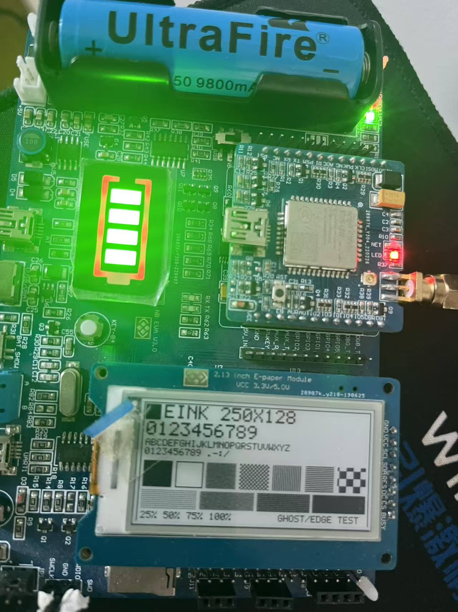

# STM32L151 + BC28 开发板 · 操作手册（第 4 篇：墨水屏点亮与显示实测）

> **系列目录 → [`README.md`](README.md)**

> ### 这是系列的第 4 篇
>
> **[第 1 篇](第1篇-搭好初始环境.md)** 跑通「编译 → 下载 → 串口打印」，
> **[第 2 篇](第2篇-BC28联网与AT指令实测.md)** 让 BC28 联上网。
> 本篇换一个方向：**点亮板子上出厂配的那块 2.13 寸墨水屏**，并且回答一个很实在的问题 ——
> **显示效果到底如不如意。**
>
> | 篇 | 主题 | 状态 |
> |---|---|---|
> | [第 1 篇](第1篇-搭好初始环境.md) | 搭好初始环境（编译 / 下载 / 看日志） | ✅ 已发布 |
> | [第 2 篇](第2篇-BC28联网与AT指令实测.md) | BC28 联网 + AT 指令实测 | ✅ 已发布 |
> | 第 3 篇 | 把数据发到自己的服务器（写进固件，不用 PC） | ⬜ 待写 |
> | **第 4 篇** | **墨水屏点亮 + 显示实测** | ✅ **本篇** |
>
> **本篇的写法**（跟前两篇一样，先划清楚）：
>
> - **面板时序全部照抄厂家驱动**，不自己发明。改动过的地方一条条说明理由。
> - **数据手册的数字给出处**（第几节 / 哪张表），不凭印象写。
> - **我自己算出来的东西标成"推算"，跟串口实测的数字分开写。**
> - 没做、没验证过的，一律进 **§10**。
>
> **实测环境**：2026-09-13，Windows 11 + Keil MDK 5.24a（编译器 V5.06u5）+ ST-Link V2 克隆版，
> `<COM 口>` = COM7。屏是**出厂就插在板子上的**那块 2.13 寸单色墨水屏。

**一句话结论**：**这块屏能用，而且效果不错。**
250×122 全屏刷一次实测 **2521 ms**，一屏文字 + 图案全部正确、没有花屏、没有断线、肉眼看不出明显残影。
但要走到这一步得先绕开两个东西：**① 厂家那个墨水屏例程根本烧不进去（§2，第一行就死循环）；
② 厂家驱动里有两处真 bug（§4）**。

另外有件事值得单独说：**这块屏的刷新次数是有配额的（100 万次）**。
这不是缺陷，是电子墨水的工作方式 —— 但它直接决定了「墨水屏适不适合显示时间」这类问题。
这笔账在 **§9**，是本篇我觉得最值钱的一节。

---

## 0. 三步速查（熟了只看这一节）

```
① 骨架：拿厂家例程 1（或任何一份已经跑通的 STM32L1xx 工程），先确认它能编译+能烧
② 换文件：
     05-墨水屏/{eink.c, eink.h, font5x7.h}  → 工程里的 HARDWARE/eink/
     05-墨水屏/main.c                       → 工程里的 Project/Test/main.c
   .uvproj：把 HARDWARE 组里那条 smp.c 换成 eink.c
     （就改 FileName + FilePath 两行，diff 见 05-墨水屏/Project.uvproj.diff）
③ 双击 flash_and_run.bat，然后同时看两处：
     屏  → 出现 §6 那个综合测试页
     串口 → 打出两次全刷耗时（2521 ms 上下）
```

> 第 ① 步里那三处**厂家工程自带的缺陷**（IncludePath / `-FP0` / `-FO15`）本篇不重复讲，
> 用 `02-工具/prep_project.py` 一键修 —— 见 [第 1 篇](第1篇-搭好初始环境.md) §5.2。

---

## 1. 这块屏是什么（硬件事实）

### 1.1 规格

| 项 | 值 | 出处 |
|---|---|---|
| 屏 | 2.13 寸单色（黑白）电子墨水，**无背光** | 实物 |
| 控制器 | **SSD1673** | 驱动源码 + 数据手册 |
| 控制器 RAM | **250 栅极（gate）× 128 源极（source）** | `0x01=0xF9` / `0x44=(0x00,0x0F)`，见 §3.1 |
| 可视区 | **250 × 122**（横屏），像素间距 0.195 mm | 推算，见下 |
| 颜色 | 只有黑、白两色（灰度要靠**抖动**凑，见 §6） | 实物 |
| 帧缓冲位约定 | **1 = 白，0 = 黑**（跟直觉相反，注意） | SSD1673 手册 |
| 屏模块 | 独立小板：`RT9193-33` LDO + `TXS0108E` 电平转换 + 68 µH 升压（产生面板要的 VGH/VGL） | 原理图 |
| 对外接口 | `SDA / SCLK / CS / DC / RST / BUSY` + `3.3V / GND` | 原理图 |

**「250 × 122」这个数是怎么来的**（推算，但能和实物对上）：

```
2.13"  = 54.1 mm 对角线
√(250² + 122²) = 277.7
54.1 mm ÷ 277.7 = 0.195 mm          ← 像素间距
250 × 0.195 = 48.7 mm（长边）   122 × 0.195 = 23.8 mm（短边）
√(48.7² + 23.8²) = 54.2 mm          ← 跟标称 2.13" 对得上 ✓
```

而控制器 RAM 是 **250 × 128**：`0x01` 寄存器写 `0xF9` = 249，即 MUX = 250 条栅极；
`0x44` 写 `(0x00, 0x0F)`，即 0..15 共 16 字节 = 128 条源极。
**源极比可视区多 6 条** —— 那几条在屏外，所以按 128 排帧缓冲是对的，多出来的是死区。

### 1.2 为什么它天然就是「横屏」

这一点很多人会绕进去，所以单独说：

**250 条栅极沿 48.7 mm 的那条长边排** → 栅极线是**竖**的，250 条沿**水平**方向铺开。

所以这块屏的**自然方向就是 250（宽）× 122（高），也就是横屏**。
本篇照片里那个横屏页面**不是我把图转了 90°**，是这块屏本来的方向 ——
你要是竖着用它，那才叫旋转。

### 1.3 引脚（**这里有个底板丝印的坑**）

MCU 侧引脚映射如下。**以驱动为准**，因为底板丝印是错的：

| 信号 | MCU 脚 | 板上网络名 | 说明 |
|---|---|---|---|
| SCLK | **PA5** | `STM32_PA5_SPI1_SCK` | 对得上 |
| SDA (MOSI) | **PA7** | `STM32_PA7_SPI1_MOSI` | 对得上 |
| CS | **PA4** | `STM32_PA4_LCD_RESET` | ⚠️ **名字是错的** |
| DC | **PB1** | `STM32_PB1_LCD_DC` | 对得上 |
| RST | **PB0** | `STM32_PB0_LCD_BL` | ⚠️ **名字是错的** |
| BUSY | **PC5** | `STM32_PC5_LCD_BUSY` | 对得上 |

> ⚠️ **`LCD_RESET` / `LCD_BL` 是从早先的 TFT 设计抄过来的旧名。**
> 墨水屏**根本没有背光**（`LCD_BL` 无从谈起），而真正的复位脚在 PB0。
> 两版厂家驱动的 `smp.h` 定义完全一致，厂家的实测视频也是在同一块板子上跑的 —— **按驱动来，别按丝印来。**

另外两点：

- **这是软件 SPI（位操作），没有用硬件 SPI 外设。** 所以你看到 SCLK/SDA 挂在 PA5/PA7 上但代码里没有 `SPI_Init()`，是对的。
- **★ 跟 BC28 不冲突。** BC28 走 USART2（PA2/PA3），CH340 走 USART1（PA9/PA10），
  跟 PA4/5/7、PB0/1、PC5 完全错开 —— 墨水屏和 NB-IoT **可以同时跑**。
  这正是「电子价签」该有的样子（第 3 篇要做的就是把这两半合起来）。

---

## 2. 硬约束：厂家那个墨水屏例程不能直接烧

资料包里唯一一份 L151 的墨水屏例程是 **例程 12（`12.水墨屏显示温度发到阿里云IOT`）**。
它开头两行是这样的：

```c
while(DHT11_Init());   // ← 底板压根没有 DHT11  →  死循环
while(BC28_Init());    // ← 就算有，也得先过 BC28 这一关
```

**底板原理图里没有任何温湿度网络**，所以第一行就卡死，**永远走不到墨水屏那段代码**。
（这也解释了为什么这块板子的墨水屏「看着像是坏的」—— 程序根本没执行到那里。）

所以本篇必须做一个**纯墨水屏版**：不带 DHT11、不带 BC28、不带阿里云，**只干「把一屏画出来」这一件事**。

> 顺带记一下两份厂家驱动的区别：
> **例程 12** 的 `smp.c` 只有 10.7 KB，大头是 **`Font.h`（79.8 KB）**；
> 而本工程沿用的那份旧 `smp.c` 是 **50.2 KB**（里面还塞着整张 `einkbmp[]` 位图）。
> 两者时序一致，本篇以旧那份为准（它就在同一块板上验证过）。

---

## 3. 面板的「魔法」：这三样必须照抄，不能自己发明

对着 SSD1673 写驱动，最大的坑是**以为自己能从数据手册推出该发什么**。
实际上有三样东西是「厂家给什么就是什么」，自己编一定不显示：

### 3.1 上电初始化序列（**顺序不能改**）

| 发的命令 | 参数 | 干什么 |
|---|---|---|
| — | `RST` 拉低 ≥10 ms → 拉高 ≥10 ms → 等 BUSY | 硬复位 |
| `0x01` | `F9 00` | 栅极设置：MUX = 250−1 = 249，从 G0 开始扫 |
| `0x3A` | `06` | dummy line 设置，**50 Hz 帧频** |
| `0x3B` | `0B` | 栅极线宽。厂家注释：`78µs × (250+6) = 19.968 ms` 一帧 |
| `0x3C` | `33` | 边框波形：全刷时边框走白 |
| `0x11` | `01` | **数据输入模式**：X 递增 / Y 递减 / 地址按 X 方向更新 |
| `0x44` | `00 0F` | RAM X 起止：0..15 → 16 字节 = 128 源极 |
| `0x45` | `F9 00` | RAM Y 起止：249..0 |
| `0x2C` | `4B` | VCOM = −1.4 V |
| `0x32` | **29 字节 LUT** | 波形查找表，见 §3.2 |
| `0x21` | `83` | 显示更新选项：**旁路**（不按 LUT 走） |
| — | — | 全白擦一次（防止上电残留 / 花屏） |
| `0x21` | `03` | 恢复：之后按 LUT 走 |
| `0x3C` | `73` | 局部刷新时边框高阻 |

### 3.2 LUT：没有它，屏不会显影

`0x32` 那 29 个字节就是**驱动波形**（哪一相给什么电压、几帧）：

```c
0x50,0xAA,0x55,0xAA,0x55,0xAA,0x11,   0x00 ×9,
0x0F ×7,                              0x01,   0x00 ×5
```

**这一串必须逐字节照抄。** 数字看着没有规律，是因为它就是厂家在特定温度/电压下
调出来的一组合适波形 —— 你改一个字节，最轻是残影加重，最重是整屏不显影。

> 例程 12 里还有一份 **`lut_part_update`**（局部刷新用的短波形），
> 那份**本篇没用**（§10 说明原因）。

### 3.3 一帧数据怎么上屏

| 步骤 | 命令 | 参数 |
|---|---|---|
| 1 | `0x4E` | `00` —— RAM X 计数 = 0 |
| 2 | `0x4F` | `F9` —— RAM Y 计数 = 249（第一列） |
| 3 | `0x24` | 开始写 RAM |
| 4 | — | **4000 字节**帧缓冲（250 × 16） |
| 5 | `0x22` | `C7` —— 显示更新，**全刷**（带清洁） |
| 6 | `0x20` | 执行 |
| 7 | — | 等 BUSY 释放 |

**为什么是 4000 字节**：250 个栅极，每个栅极 128 个像素 = 16 字节。`250 × 16 = 4000`。
刚好 4000 字节，STM32L151RC 的 32 KB RAM 放得下 —— **整屏帧缓冲在 MCU 里能装下**，
这是这块板子能跑得舒服的关键。

---

## 4. 厂家驱动里的两个真 bug

这两处都是**我自己在被卡住之后回头看源码才发现的**，而且**都不在墨水屏那段逻辑里** ——
这也是它们难查的原因。

### 4.1 RCC 时钟：函数和常量不配套

厂家 `smp.c` 里这么写（**两处**，GPIOB 和 GPIOA 各一行）：

```c
RCC_APB2PeriphClockCmd(RCC_AHBPeriph_GPIOB, ENABLE);
RCC_APB2PeriphClockCmd(RCC_AHBPeriph_GPIOA, ENABLE);
```

**左边函数写的是 `APB2ENR` 寄存器，右边常量却是 `AHBENR` 的位号。** 后果可以精确算出来：

| 这一行 | 传进去的值 | 实际写进了 APB2ENR 的 | 等于打开了 |
|---|---|---|---|
| `RCC_AHBPeriph_GPIOA` | `0x00000001` | bit 0 | **SYSCFG**（歪打正着） |
| `RCC_AHBPeriph_GPIOB` | `0x00000002` | bit 1（**保留位**） | **什么都没开** |

（位值出处：`stm32l1xx.h:3731-3733` 与 `:3749`；
`RCC_APB2PeriphClockCmd` 的实现就是一句 `RCC->APB2ENR |= RCC_APB2Periph`。）

**所以这两行都没能打开它们声称的 GPIO 时钟。**

> **那为什么厂家例程看起来是好的？**
> 因为那份工程里 GPIOA/B/C 的时钟**早被别处正确打开了**：
> `LED/LED.c:5` 正确地开了 GPIOC（LED 在 PC3），
> `usart/usart.c:61` 和 `:165` 分别正确地开了 GPIOA 和 GPIOB。
> **这个 bug 是一颗"哑弹"** —— 它在你按厂家那个顺序初始化时永远不响。
>
> 而它一旦响，症状极其难查：**PB0/PB1 是 RST 和 DC 脚，时钟没开 → 屏完全不响应**，
> 看起来就像「屏坏了 / 线没插好」。
>
> **我这边不赌初始化顺序**：`eink.c` 里一次性正确开齐 A/B/C，不依赖任何别的模块：

```c
RCC_AHBPeriphClockCmd(RCC_AHBPeriph_GPIOA | RCC_AHBPeriph_GPIOB |
                      RCC_AHBPeriph_GPIOC, ENABLE);
```

### 4.2 BUSY 被配成**输出**，然后读它 → 假轮询

这是第二个，也是**更隐蔽的一个**。厂家代码：

```c
/* smp.c:617-620 —— 把 PC5 配成了输出 */
GPIO_InitStructure.GPIO_Pin  = GPIO_Pin_5;
GPIO_InitStructure.GPIO_Mode = GPIO_Mode_OUT;     // ← 问题在这
GPIO_Init(GPIOC, &GPIO_InitStructure);

/* smp.h —— 而读取用的是"读输出锁存器" */
#define nBUSY  GPIO_ReadOutputDataBit(GPIOC, GPIO_Pin_5)

/* smp.c —— 于是这个循环形同虚设 */
void READBUSY(void)
{
    while(1) { if(nBUSY==0) break; }   // 一进来就 break
    DELAY_S(2);                        // 真正在等的是这 2 秒
}
```

**`BUSY` 是面板的输出、MCU 的输入。** 厂家把它配成了 MCU 的输出，
再用 `GPIO_ReadOutputDataBit()` 去读**输出锁存器** ——
那个锁存器复位后是 0，而且**除了这条语句没人动过它**，所以：

- `nBUSY` 恒等于 0 → `while(1)` **第一次判断就 break** → **轮询等于没写**；
- 真正让程序"等"够时间的，是后面那句 `DELAY_S(2)`。

> 这里还有个**电气隐患**：PC5 被配成推挽输出，而面板也在驱动这条线 ——
> 等于 MCU 跟面板的输出**对顶**。这次没出事，但这属于侥幸，不该留着。

**我的改法**（`eink.c`）：配成输入 + 读**真电平** + **带超时**：

```c
GPIO_InitStructure.GPIO_Mode = GPIO_Mode_IN;                    /* 输入 */
GPIO_Init(GPIOC, &GPIO_InitStructure);

#define nBUSY  GPIO_ReadInputDataBit(GPIOC, GPIO_Pin_5)          /* 读真电平 */

unsigned char EINK_BusyWait(unsigned int timeout_ms)             /* 带超时, 不硬等 */
{
    unsigned int t0 = g_ms;
    while (nBUSY != 0) {                                         /* 高 = 忙 */
        TickPoll();
        if ((g_ms - t0) > timeout_ms) return 0;                   /* 超时返回 0 */
    }
    return 1;
}
```

**BUSY 是低电平有效**（低 = 空闲，高 = 忙）。
改对之后有个额外好处：**它变成了一个"屏在不在"的探测器** ——
屏没插好时 BUSY 会被上拉电阻拉高，程序 8 秒后报超时退出，而不是死等。

### 4.3 顺带：「刷一次要 20 秒」的真凶

网上提到这块板子，常有人说「墨水屏刷新奇慢，要 20 秒」。**原因不在屏，在厂家的延时：**

| 位置 | 延时 | 累计 |
|---|---|---|
| `EINK_ShowChar()` | `DELAY_S(5)` × 2 = **10 秒 / 字符** | 写一行字就是几分钟 |
| `DIS_IMG()` | `DELAY_S(5)` × 2 = **10 秒** | 每刷一张图 |
| `READBUSY()` | `DELAY_S(2)` = **2 秒** | 每次等 BUSY |

**面板本身一次全刷就是 2.5 秒**（§7 实测）。
厂家这些 `DELAY_S` 是「不知道屏什么时候好，干脆硬等」的写法 ——
把 BUSY 读对（§4.2）之后，这些延时**全部可以删掉**。

---

## 5. 我写的驱动（`eink.c` / `eink.h`）

设计目标就一句：**最小、只为"看效果"**，所以砍得比较狠：

**砍掉的**：`Font.h`（79.8 KB 字模 + 整张位图）、图片数组 / `DIS_IMG` / `PIC_*` / 二维码、
厂家的 `EINK_ShowChar/String`、局部刷新窗口 `SetpointXY`、所有 `DELAY_S`。

**留下的**：§3 那三样「魔法」逐字照抄（这是能显示的前提），加上自己写的画图部分。

### 5.1 帧缓冲

```c
static unsigned char fb[EINK_W][16];     /* [栅极 0..249][源极字节 0..15] = 4000 字节 */
```

- **`1 = 白，0 = 黑`**（跟直觉相反，驱动里写死了，用 `EINK_BLACK` / `EINK_WHITE` 就不会记错）
- 取像素：`fb[x][y >> 3]`，掩码 `0x80 >> (y & 7)`（MSB 先出）
- **画图只改这个数组，不碰屏**；要上屏必须显式调 `EINK_Refresh()`

这个「画」和「刷」分开的设计很重要：墨水屏刷新一次要 2.5 秒，
把一屏内容先拼好再一次刷，比"边算边刷"快一个数量级。

### 5.2 对上层的接口（`eink.h`）

```c
#define EINK_W 250
#define EINK_H 128
#define EINK_BLACK 0
#define EINK_WHITE 1

void         EINK_Init(void);                    /* 配 GPIO + 复位 + 寄存器序列 + 擦白一次 */
void         EINK_Clear(unsigned char color);
void         EINK_SetPixel(x, y, color);
void         EINK_FillRect(x0, y0, x1, y1, color);
void         EINK_Rect(x0, y0, x1, y1, color);

/* "看效果"专用图元 */
void         EINK_Checker(x0, y0, x1, y1, cell, color);   /* 棋盘格 */
void         EINK_VLines(...), EINK_HLines(...);          /* 细线 */
void         EINK_Dither(x0, y0, x1, y1, level, color);   /* 4x4 抖动, level 0..16 */

/* 文字: 5x7 点阵, scale = 1/2/3 -> 字高 7/14/21 像素 */
void         EINK_Char(x, y, ch, scale);
void         EINK_Text(x, y, const char *str, scale);

/* 上屏 */
unsigned int EINK_Refresh(unsigned char *ok);    /* 返回本次耗时(ms), ok = BUSY 是否正常 */
unsigned char EINK_BusyWait(unsigned int timeout_ms);
```

### 5.3 字库（`font5x7.h`）

厂家的 `Font.h` 里那张 `F8X16` **位序从静态文本反推不出来** ——
我按行主序、列主序、旋转 90° 三种读法都对不上 `A` / `H` / `l` 的笔画连通性。

**我没有赌它，而是自己生成了一张 5×7 的**：字模用 `#` / `.` 画出来，
生成时**在终端把每个字打印一遍**（肉眼验），再输出 C 数组。
脚本是 [`02-工具/gen_font5x7.py`](02-工具/gen_font5x7.py)，覆盖 ASCII `0x20`~`0x5A`（59 个字形），
**连注释一共 3.5 KB**（真正的数据只有 59 × 7 = **413 字节**）。

> **1 倍字偏小，这是个实话**：0.195 mm 像素间距下，7 像素高 ≈ **1.4 mm**；
> 2 倍字（14 像素）≈ 2.7 mm 才舒服。本篇测试页两种都放了，你一看照片就知道该用哪个。

### 5.4 体积

| | 值 |
|---|---|
| 编译结果 | `Code=6652  RO-data=736  RW-data=72  ZI-data=6584` |
| **占 Flash** | 6652 + 736 + 72 = **7460 字节 ≈ 7.3 KB** |
| **占 RAM** | RW-data 72 + ZI-data 6584 = **6656 字节 ≈ 6.5 KB**（其中 4000 字节是帧缓冲） |
| 编译告警 | **0 Error(s), 0 Warning(s)** |

---

## 6. 综合测试页：一屏回答「效果是否如意」

这块屏好不好，不用猜 —— 一屏把该看的都画上，看一眼就有结论。测试页布局：

| 区域 | 画的是什么 | 用来看什么 |
|---|---|---|
| **最外框** | 画在帧缓冲的物理边界 `0..127` 上 | **最下面那条边看不见 → 可视高度不到 128**（标称 122） |
| **左上角实心块** | 原点标记 | 它落在哪个角 → 方向 / 镜像对不对 |
| `EINK 250X128` | 2 倍字 | 大字号清晰度、笔画完整性 |
| `0123456789` | 2 倍字 | 数字辨识度 |
| `ABCDEFGHIJKLMNOPQRSTUVWXYZ` | 1 倍字 | 小字号能不能读 |
| `0123456789 .-:/` | 1 倍字 | 标点符号 |
| **图案带（7 块）** | 纯黑块 / 白块+边框 / 1px 棋盘 / 2px 棋盘 / 竖细线 / 横细线 / 8px 大格棋盘 | 对比度、均匀性、**分辨率极限**、**断线 = SPI 时序问题**、**残影** |
| **灰阶带（4 段）** | 抖动 25% / 50% / 75% / 100% 黑 | 只有黑白两色时的**过渡能力** |
| **底部标签** | `25% 50% 75% 100%` 与 `GHOST/EDGE TEST` | 对照用 |

两个设计上的小用心：

- **最外框是故意画在 RAM 边界上的**。这样"可视区到底多大"就不用查手册了 —— 看照片就行。
- **8px 大格棋盘是残影试纸**。大块黑白交替的地方残影最明显，如果连它都干净，这块屏的残影就不用担心了。

**串口**（CH340，9600）同步打印每一步和**每次全刷的毫秒数** —— 这是本篇唯一"可量化"的指标。

---

## 7. 实测结果

### 7.1 编译

```
*** Using Compiler 'V5.06 update 5 (build 528)', folder: 'C:\Keil_v5\ARM\ARMCC\Bin'
Build target 'STM32L1XX_MD(STM32L1xxxBxx)'
compiling eink.c...
linking...
Program Size: Code=6652 RO-data=736 RW-data=72 ZI-data=6584
".\STM32L152-EVAL\STM32L152-EVAL.axf" - 0 Error(s), 0 Warning(s).
```

### 7.2 烧录

```
Load "D:\...\eink-demo\Project\Test\MDK-ARM\STM32L152-EVAL\STM32L152-EVAL.axf"
Erase Done.Programming Done.Verify OK.Application running ...
```

**判据照旧是最后那个 `Application running`**（第 1 篇 §6.8 那个坑）。

### 7.3 串口（照抄）

```
     done  (init ends with a full white refresh)

[2] draw test page into 4000-byte framebuffer ...
     done

[3] full refresh #1 ...
     2521 ms   BUSY released OK
[4] full refresh #2 (same content, ghosting check) ...
     2520 ms   BUSY released OK

--------------------------------------------------
Look at the panel:
  - solid black square at the corner = origin marker
  ...
--------------------------------------------------
```

> **上面这段是从 `[1]` 的尾巴开始抓到的**，不是从头。原因是**板子上电的瞬间就开始打印**，
> 而串口工具要等烧录结束才能打开 —— 开机 banner 和 `[1]` 的前两行在这之前就滚过去了。
> 这不是故障，是抓日志的时序问题（想抓全就得先开串口、再复位，本篇没折腾）。

**三个数字**：

| 量 | 值 | 说明 |
|---|---|---|
| 全刷 #1 | **2521 ms** | |
| 全刷 #2 | **2520 ms** | 同内容再刷一次（残影对照），**稳定复现** |
| BUSY | **released OK** | BUSY 轮询真的在工作（§4.2 修好之后才有这个结论） |

> **`BUSY released OK` 这句话本身就是"屏插好了"的证据。**
> 如果屏没插好，BUSY 会被上拉电阻拉高，这里会打 `TIMEOUT!`。
> 换句话说：**修对 BUSY 之后，"屏在不在"变成了一个程序能自己回答的问题** ——
> 这是 §4.2 那个 bug 修掉之后的额外收获。

**关于 2521 ms 这个数和数据手册的差异**（重要，别被手册吓到）：

| 来源 | 时间 | 折算帧数 |
|---|---|---|
| **实测**（本篇，全刷 `0xC7`） | **2521 ms** | ≈ **126 帧** |
| 数据手册 `Tupdate`（典型值 @25 °C） | 680 ms | ≈ 34 帧 |

折算依据：`0x3B = 0x0B` → 一帧 = `78µs × (250+6) = 19.968 ms`（厂家注释给的算式），
而 `0x3A` 那条注释写的也是 **50 Hz** → `1/50 = 20 ms`，**两边自洽**。

**差在哪？差在波形帧数，不在我们的代码。**
实测用的 `0xC7` 是**带清洁的全刷**（多出好几轮反相，对比度高、残影小），
数据手册那个 680 ms 是**最简波形的典型值**。

> 顺带算一下我们自己的开销：4000 字节的位操作 SPI（约 1 MHz）
> ≈ **32 ms**，占 2521 ms 的 **1.3%** —— 可以忽略。
> **也就是说这 2.5 秒几乎全是面板在干活。**

### 7.4 屏上（照片）



逐项核对，**全部正确**：

| 检查项 | 结果 |
|---|---|
| 方向 | ✅ **横屏、正向**，没有镜像也没有倒置 |
| 外框 | ✅ **四条边都在**（含底边）→ 可视高度就是 128 的那一档，屏没被裁 |
| `EINK 250X128`（2 倍字） | ✅ 清晰，笔画无断裂 |
| `0123456789`（2 倍字） | ✅ 全部可辨 |
| A–Z（1 倍字） | ✅ 26 个字母都能读（**偏小**，见 §5.3） |
| 图案带 7 块 | ✅ 纯黑块均匀、1px 棋盘干净无噪点、**细线连续未断** |
| 灰阶带 | ✅ 25/50/75/100% 四档能看出层次 |
| 残影 | ✅ **肉眼看不到明显残影**（8px 大格棋盘也干净） |
| 空白区 | ✅ 干净的白，没有花屏 / 竖条纹 |

**一个要说明的地方**：照片**左上角那块被一根蓝色 FPC 排线挡住了** ——
那根排线物理上压在屏的左上角，把"原点标记"（左上角那个实心方块）遮掉了。
**这是拍照角度的问题，不是显示的问题。**

### 7.5 空闲时它在干什么

刷完之后**不再刷屏**，只每 10 秒闪一下 PC3 的灯报活。实测（`read_com.ps1` 抓的）：

```
RX> alive 30 s
RX> alive 40 s
RX> alive 50 s
```

顺手做了一次**上电时间的交叉验证**：09:13:04 抓到 `alive 80 s` → 反推起跑于 **09:11:44**，
而 UV4 的烧录日志写的是 **09:11:45** —— **对得上**。
结论：**程序从上电起连续运行，没有偷偷复位**；屏上的画面一直保持，不刷新也不掉。

> **这其实就是墨水屏最大的价值**：**显示内容不耗电**。
> 待机功耗数据手册给的是 **0.017 mW（17 µW）**，而刷新时是 **26.4 mW** —— 差 **1500 倍**。
> 这笔账在 §9 展开。

---

## 8. 失败判据（对号入座，别瞎试）

| 现象 | 大概率是 |
|---|---|
| **全白，一点反应都没有** | 初始化没跑到 / 屏没插稳 / **RST 或 DC 的 GPIO 时钟没开**（§4.1 就是这个症状） |
| **串口打 `TIMEOUT!`** | BUSY 一直不释放 → 屏没插好、或者 SPI 根本发不出去 |
| **花屏、随机噪点** | 软件 SPI 太快，或位序 / 字节序反了 |
| **只显示半边 / 整屏错位** | 坐标约定或扫描方向错（帧缓冲下标顺序、`0x11` 数据输入模式） |
| **内容对但对比度很差 / 残影重** | 面板电压 / LUT 问题 —— **这属于"效果不如意"本身**，不是驱动 bug |
| **能显示但过了几秒自己变淡** | 边框波形（`0x3C`）或 VCOM（`0x2C`）没设对 |

---

## 9. 墨水屏适合放什么：先算这笔「刷新寿命账」

这是本篇我觉得最值钱的一节。

**电子墨水跟 LCD 最本质的区别是：LCD 刷新不损耗，墨水屏每次刷新都在花配额。**

数据手册（`13.EINK墨水瓶资料/参考资料/2.13inch_e-Paper_Datasheet.pdf`，第 16.1 节）写得很清楚：

| 项目 | 数值 |
|---|---|
| 单次刷新时间 `Tupdate` | 典型 **680 ms** @25 °C |
| **面板寿命** | **100 万次，或 5 年**（条件：**0~40 °C**） |
| 工作温度 | **低于 0 °C 或高于 40 °C 时，寿命不予保证** |
| 刷新时功耗 | 典型 **26.4 mW** / 最大 40 mW |
| 待机功耗 | **0.017 mW** |

### 9.1 「显示时间」这笔账

按实测 **67 mJ/次**（26.4 mW × 2.521 s，**估算**）算：

| 刷新频率 | 每天次数 | 100 万次能用多久 | 每天耗电 | 1000 mAh 电池能用 |
|---|---|---|---|---|
| **每秒**（带秒针） | 86 400 | **11.6 天** ❌ | 5754 J | **2.3 天** ❌ |
| **每分钟**（HH:MM） | 1 440 | **1 年 11 个月** | 96 J | 139 天 |
| 每 5 分钟 | 288 | 9.5 年 | 19 J | 694 天 |
| 每小时 | 24 | 114 年 | 1.6 J | 电池自放电说了算 |

> **估算的口径**（怕你拿去复用）：功耗用的是**面板**的 26.4 mW，不含屏模块上的 LDO /
> 电平转换和 MCU；电池按 `3.7V × 1000 mAh = 13320 J` 估，实际容量看你配多大的电池。

### 9.2 三个死结

1. **秒级物理上不可能。** 刷一次要 2.5 秒，**比 1 秒还长** —— 刷新时间都不够用，跟代码优化无关。
2. **寿命是消耗品。** 每分钟刷一次，**接近 2 年就要换屏**。
3. **丢掉核心优势。** 待机 17 µW vs 刷新 26.4 mW，差 **1500 倍**。
   每分钟叫醒屏幕一次，等于把它当 LCD 用，白瞎了"保持画面零功耗"这个唯一的杀手锏。

还有个**观感**问题：全刷那 2.5 秒里，屏幕会**全屏黑白反相闪好几轮**（就是 LUT 里的清洁波形）。
**一分钟闪一次，非常扎眼。**

### 9.3 那结论是什么

- **日 / 周级别的信息** → **完全没问题**，寿命可以忽略。
- **分钟级时钟** → **技术上成立**，但前提是换**局部刷新**（不然每分钟闪一次），
  而且要接受 **2 年换一块屏**、以及**别放在 0~40 °C 以外的地方**
  （放阳台或没暖气的房间，冬天的刷新会明显变慢、变黑）。
- **最适合的用法** → **时间跟着"主内容"顺带刷。**
  这正是这块板子的本行：**电子价签是"价格变了才刷"**，时间只是附带的小角标，
  一天刷几次，**寿命按百年算**。
- **绝对不要** → 秒针、倒计时秒数、动画。

> 这也解释了为什么墨水屏日历、墨水屏桌面时钟这类产品是存在的 ——
> 它们用的是**局部刷新 + 分钟或小时粒度**，不是拿它当秒表。

---

## 10. 本篇没做 / 没定论（**照实说**）

| 事 | 状态 |
|---|---|
| **局部刷新** | ❌ **没做**。例程 12 里那份 `lut_part_update` 和 `SetpointXY` 都没搬过来。**这是"做时钟"的前提**，也是下一篇最该补的东西 |
| **真灰度** | ❌ 没做。现在只有**抖动**凑出来的假灰阶。SSD1673 本身支持多级灰度（要靠 LUT 配），**没验证** |
| **中文字库** | ❌ 没做。只有 ASCII `0x20`~`0x5A` |
| **低功耗 / 电池续航** | ❌ **没实测**。§9 那张表是**推算**，没有真拿电池跑过 |
| **温度对刷新时间的影响** | ❌ 没测。数据手册给了 0~40 °C 的寿命条件，但"低温下刷新会慢多少"本篇没量 |
| **680 ms vs 2521 ms** | ⚠️ 只做到"**差在波形帧数**"这一步**推断**（§7.3），**没有把 LUT 逐相拆开验证** |
| **残影的定量评估** | ⚠️ 只有"**肉眼看不到明显残影**"这一个结论。没有仪器测，也没有做"反复刷同一区域"的耐久试验 |
| **屏模块上的升压电路** | ⚠️ **没测**。VGH/VGL 到底升到多少伏、纹波如何，本篇没量 |
| **抓全开机日志** | ⚠️ 没做到（§7.3 说明了原因）。要抓全得"先开串口再复位"，本篇没折腾 |
| **第 3 篇（发数据到自己的服务器）** | ⬜ **仍未写**。本篇是纯墨水屏，没碰 BC28 —— 两块可以同时跑（§1.3），但**"同时跑"这件事本篇也没实测** |

---

## 11. 本篇要跟哪几样东西一起发

| 一起发什么 | 为什么 | 在哪 |
|---|---|---|
| **① 本篇文档** | 就是这一份 | 仓库根目录 |
| **② 驱动 `eink.c` + `eink.h`** | 本篇的核心，§5 那一套 | [`05-墨水屏/`](05-墨水屏/) |
| **③ 字库 `font5x7.h`** | 编译必需 | `05-墨水屏/` |
| **④ 测试页 `main.c`** | §6 那屏内容 | `05-墨水屏/` |
| **⑤ `main.c.diff`** | 让你看清它相对厂家模板**删了什么** | `05-墨水屏/main.c.diff` |
| **⑥ `Project.uvproj.diff`** | 工程改动**只有一行**（`smp.c` → `eink.c`，4 个 target 各一处） | `05-墨水屏/Project.uvproj.diff` |
| **⑦ 字库生成器 `gen_font5x7.py`** | 想改字模 / 扩字符集就用它（**它会在终端把字打印出来给你验**） | [`02-工具/`](02-工具/) |
| **⑧ 第 1 篇那套工具脚本** | 编译、烧录、看串口日志（§0 第 ③ 步要用） | `02-工具/` |
| **⑨ 一张实拍照片** | §7.4 的效果证据 | `images/04-墨水屏测试页.jpg` |
| **⑩ 厂家资料包** | 骨架工程（例程 1）、例程 12、**墨水屏数据手册**都在里面 | **只能跟卖家/作者要**（3.4 G 传不上仓库） |

---

## 12. 下一步（第 3 篇 & 第 5 篇）

本篇把墨水屏**点亮了，而且给出了量化结论**。往后有两个方向：

**第 3 篇（原定，仍未写）—— 把数据发到自己的服务器。**
[第 2 篇](第2篇-BC28联网与AT指令实测.md) §9 已经列好了要踩的坑（`NSOCO` 要等 URC、`NSORF` 要轮询、
PSM/eDRX 出厂就开着、服务器优先放国内）。

**第 5 篇（本篇衍生的）—— 让墨水屏显示"有用的东西"。**
本篇已经把 §9 那笔账算清楚了，所以第 5 篇该做的是：

1. **局部刷新**（`lut_part_update` + `SetpointXY`）——
   **这是能不能做时间类应用的前提**（不然每分钟全屏闪一次）。顺便能量出局部刷新到底几毫秒。
2. **接 BC28 显示实时数据**（比如第 2 篇验过的网络状态、`NUESTATS` 的信号值），
   顺带验证 §1.3 说的"墨水屏和 NB-IoT 能同时跑"。
3. **真灰度或中文字库**（看哪个更值得做）。

> **先做哪个？** 我建议 **第 3 篇优先** —— 它是系列原本的主线，
> 而且"墨水屏 + 联网"这个组合才是这块板子（电子价签）的完整形态。
> 第 5 篇的两件事（局部刷新 / 显示实时数据）都建立在第 3 篇通了的基础上。
